# Frontend CI/CD Pipeline

## Visual Lifecycle

```mermaid
flowchart TD
    Start([Push Code]) --> Event{Event Type?}

    Event -->|Push to develop| Path1[🗺️ Show Path: develop → Firebase Develop]
    Event -->|Push to master| Path2[🗺️ Show Path: master → Firebase Production]
    Event -->|Pull Request| Path3[🗺️ Show Path: PR → No Deploy]
    Event -->|Manual Run| Path4[🗺️ Show Path: Based on inputs]

    Path1 --> Quality[✅ Quality Checks]
    Path2 --> Quality
    Path3 --> Quality
    Path4 --> Quality

    Quality --> Analyze[flutter analyze]
    Analyze --> Format[dart format]
    Format --> Verify[Verify API Client]

    Verify --> Build[📦 Build Flutter Web]
    Build --> Artifact[Upload Artifacts]

    Artifact --> DeployCheck{Deploy?}

    DeployCheck -->|develop branch| DeployDev[🟡 Deploy to Develop]
    DeployCheck -->|master branch| DeployProd[🔴 Deploy to Production]
    DeployCheck -->|PR or skip| NoDeploy[❌ No Deploy]

    DeployDev --> DevURL[🌐 https://easypool-30af3--develop-xxx.web.app]
    DeployProd --> ProdURL[🌐 https://easypool-30af3.web.app<br/>⚠️ Redirects to Vercel]
    NoDeploy --> End([✅ Done])
    DevURL --> End
    ProdURL --> End

    style Path1 fill:#fff3cd
    style Path2 fill:#f8d7da
    style Path3 fill:#d1ecf1
    style Path4 fill:#e2e3e5
    style DeployDev fill:#fff3cd
    style DeployProd fill:#f8d7da
    style NoDeploy fill:#d1ecf1
```



## Example Scenarios

### Scenario 1: Normal Development Flow

```mermaid
sequenceDiagram
    participant Dev as Developer
    participant Git as Git develop
    participant CI as GitHub Actions
    participant FB as Firebase Develop

    Dev->>Git: git push origin develop
    Git->>CI: Trigger CI Pipeline
    CI->>CI: 🗺️ Show Path (develop → Firebase Develop)
    CI->>CI: ✅ Quality Checks
    CI->>CI: 📦 Build Flutter Web
    CI->>FB: 🟡 Deploy to develop channel
    FB-->>Dev: 🌐 Preview URL
    Note over Dev,FB: Test at: easypool-30af3--develop-xxx.web.app
```


### Scenario 2: Production Release

```mermaid
sequenceDiagram
    participant Dev as Developer
    participant Git as Git master
    participant CI as GitHub Actions
    participant FB as Firebase Production
    participant Vercel as Vercel (Live Users)

    Dev->>Git: git push origin master
    Git->>CI: Trigger CI Pipeline
    CI->>CI: 🗺️ Show Path (master → Firebase Production)
    CI->>CI: ✅ Quality Checks
    CI->>CI: 📦 Build Flutter Web
    CI->>FB: 🔴 Deploy to production
    FB-->>Vercel: Redirect all traffic
    Vercel-->>Dev: ⚠️ Real users unaffected
    Note over Dev,Vercel: easypool-30af3.web.app → school-portal-lilac.vercel.app
```


### Scenario 3: Manual Override (Test prod code in develop)

```mermaid
sequenceDiagram
    participant Dev as Developer
    participant UI as GitHub Actions UI
    participant CI as GitHub Actions
    participant FB as Firebase Develop

    Dev->>UI: Click "Run workflow"
    Dev->>UI: Branch: master
    Dev->>UI: Deploy target: develop
    UI->>CI: Trigger with inputs
    CI->>CI: 🗺️ Show Path (manual → develop)
    CI->>CI: ✅ Quality Checks (master code)
    CI->>CI: 📦 Build Flutter Web (master code)
    CI->>FB: 🟡 Deploy to develop channel
    FB-->>Dev: 🌐 Test production code safely
    Note over Dev,FB: master code in develop environment
```


### Scenario 4: Quality Check Only (No Deploy)

```mermaid
sequenceDiagram
    participant Dev as Developer
    participant UI as GitHub Actions UI
    participant CI as GitHub Actions

    Dev->>UI: Click "Run workflow"
    Dev->>UI: ☑️ Skip deployment
    UI->>CI: Trigger with skip_deploy=true
    CI->>CI: 🗺️ Show Path (skip deployment)
    CI->>CI: ✅ Quality Checks
    CI->>CI: 📦 Build Flutter Web
    CI->>CI: ❌ Skip Deploy
    CI-->>Dev: ✅ Code verified, nothing deployed
    Note over Dev,CI: Fast feedback without deployment
```


## Manual Controls

### 1️⃣ Skip Deployment
```yaml
skip_deploy: true/false
```
**Use when:** Just want to verify code compiles

### 2️⃣ Force Deployment Target
```yaml
deploy_target: auto | develop | production | skip
```
**Options:**
- `auto` - Use branch to decide (default)
- `develop` - Force deploy to develop channel
- `production` - Force deploy to production
- `skip` - No deployment

## Quick Reference

| Branch | Event | Deploy To | URL |
|--------|-------|-----------|-----|
| develop | push | Firebase Develop | `easypool-30af3--develop-xxx.web.app` |
| master | push | Firebase Production | `easypool-30af3.web.app` → Vercel |
| any | PR | None | No deployment |
| any | manual + skip_deploy | None | No deployment |
| any | manual + deploy_target=develop | Firebase Develop | `easypool-30af3--develop-xxx.web.app` |
| any | manual + deploy_target=production | Firebase Production | `easypool-30af3.web.app` → Vercel |

## Pipeline Stages

```mermaid
graph LR
    A[🗺️ Path] --> B[✅ Quality]
    B --> C[📦 Build]
    C --> D{Deploy?}
    D -->|Yes| E[🚀 Firebase]
    D -->|No| F[✅ Done]
    E --> F

    style A fill:#e3f2fd
    style B fill:#f3e5f5
    style C fill:#fff9c4
    style D fill:#ffe0b2
    style E fill:#c8e6c9
    style F fill:#b2dfdb
```



## Industry Standard
✅ Static sites → CDN (Firebase Hosting)
❌ Static sites → Docker containers (unnecessary complexity)

This follows Fortune 500 best practices for deploying static frontends.
